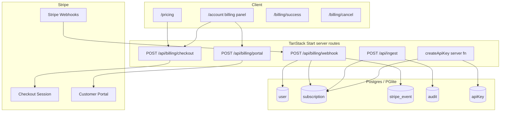
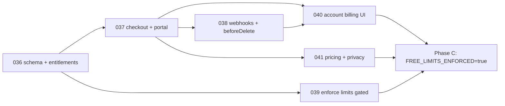

# Pricing Plans + Stripe Integration for Mend Website

| Field | Value |
|-------|--------|
| **Document** | Pricing plans + Stripe integration (mend-website) |
| **Author** | TBD |
| **Date** | 2026-07-19 |
| **Status** | Draft (revised after design review) |
| **Repo** | `/Users/jonpreece/source/mend-website` |
| **Audience** | Senior engineers implementing sequential plans on `main` |

---

## Overview

Mend’s Chrome extension stays free, open source, and fully usable offline without an account. Monetization targets only the **optional cloud dashboard**: saved-audit retention, ingest rate limits, API-key quotas, and (later) collaboration. This document specifies Free vs Pro product limits, a Stripe Billing integration for monthly/yearly subscriptions, Drizzle schema and migrations, server-side entitlement enforcement, marketing/account UI, security/privacy updates, and an ordered implementation plan (`plans/036+` style units on `main`).

**Proposed solution in one sentence:** Stripe Checkout + Customer Portal + transactionally idempotent webhooks mirror subscription state into a `subscription` table; a pure `entitlements` module derives `effectivePlan` from product price + Stripe status; Free tightenings and retention purge are env-gated so `main` deploys stay safe; Pro is self-serve; Team is deferred.

---

## Background & Motivation

### Current state

| Area | Today |
|------|--------|
| Extension | Free, MIT, private by default — no account required ([README](file:///Users/jonpreece/source/mend-website/README.md)) |
| Dashboard | Optional free account; email/password, optional Google/GitHub OAuth, magic link |
| Sync | Extension → `POST /api/ingest` with `Authorization: Bearer <api key>` ([`src/routes/api/ingest.ts`](file:///Users/jonpreece/source/mend-website/src/routes/api/ingest.ts)) |
| Rate limit | 60 req/min per user, in-process fixed window, single Railway node ([`src/lib/rate-limit.ts`](file:///Users/jonpreece/source/mend-website/src/lib/rate-limit.ts)) |
| API keys | Up to **20** active keys (`MAX_ACTIVE_KEYS` in [`src/lib/account-queries.ts`](file:///Users/jonpreece/source/mend-website/src/lib/account-queries.ts)) |
| Export | Full JSON via `GET /api/export` ([`src/routes/api/export.ts`](file:///Users/jonpreece/source/mend-website/src/routes/api/export.ts)) |
| Schema | Better Auth tables + `audit` / `apiKey` / `violation` ([`src/db/schema.ts`](file:///Users/jonpreece/source/mend-website/src/db/schema.ts)) |
| Billing | **None** — no Stripe dependency, no plan columns, no pricing page |
| Deploy | Railway, one process; `preDeployCommand`: `pnpm db:migrate` ([`railway.json`](file:///Users/jonpreece/source/mend-website/railway.json)) |

### Pain points

1. **No monetization path** for hosting, support, and dashboard growth while keeping the extension free.
2. **Unbounded free-tier storage pressure**: ingest is rate-limited for write frequency but not for total stored audits / retention; a free account can accumulate large `audit`/`violation` tables indefinitely.
3. **Key quota is flat**: 20 keys is generous for free and does not differentiate paid power users (CI, multiple machines) later.
4. **Positioning risk**: any paid surface must never imply the extension itself is paid or requires an account.

### Why now

The portal already has auth, ingest, export, danger-zone delete, and account UX. Adding billing before multi-tenant “Team” keeps schema and enforcement personal (one user = one subscriber), which matches Better Auth’s current single-user model and avoids workspace/org explosion in v1.

---

## Goals & Non-Goals

### Goals

1. Ship a **public `/pricing` page** and **account billing section** consistent with MarketingShell / Paper & Rust design.
2. Accept **Stripe subscriptions** (monthly + yearly) via Checkout; manage cancel/upgrade/payment methods via **Customer Portal**.
3. Process **webhooks** with signature verification and **idempotent** event application.
4. Mirror plan/status into Postgres so **entitlements are enforced server-side** (never trust the client).
5. Define concrete **Free vs Pro limits** for: ingest rate, audit retention (and soft count cap), active API keys, export (v1: both get full JSON export; Pro gets longer history included in export).
6. Document env vars, test mode, migration discipline (`db:generate` → commit SQL → Railway `db:migrate`).
7. Update **Privacy** copy for Stripe as a payment processor.
8. Leave an ordered **implementation plan** executable as sequential `plans/036+` units on `main`.

### Non-Goals (v1)

- **Team / multi-seat / shared workspaces** — deferred (see Phasing).
- Stripe **Elements** custom card form (use Checkout + Portal only).
- Metered / usage-based billing (overage charges).
- In-app invoice list beyond Portal.
- Extension UI for plans (extension remains plan-agnostic; limits are server responses).
- Migrating existing users to paid (all start Free).
- Multi-currency localization beyond Stripe Dashboard price configuration.
- Redis / shared rate-limit store (still single Railway node).

---

## Product Design: Free / Pro (Team deferred)

### Positioning principles

1. **Extension is free forever** — offline, no account, full audit capability.
2. **Dashboard Free is real product** — not a 3-day trial; modest caps for individuals.
3. **Pro is for heavy personal use** — more history, higher limits, more keys.
4. **Copy must say “optional dashboard”** — never “upgrade Mend” as if the scanner is locked.
5. **Team is v2** — seats, shared audits, and org billing multiply tenancy; defer until Pro validates demand.

### Recommended tiers

| Capability | Free | Pro |
|------------|------|-----|
| Extension (local audits) | Full | Full |
| Dashboard account | Yes | Yes |
| Saved audit **retention** | **30 days** (runs older than 30d purged) | **2 years** |
| Soft **audit row cap** (safety) | **200** runs; **new** ingests return `403 AUDIT_CAP` when at cap (duplicate retries still `200`) | **50_000** runs (same rule: cap only blocks *new* rows) |
| Distinct URLs (informational; not hard-gated v1) | Soft guidance only | Soft guidance only |
| Ingest rate limit | **60 / min** (current) | **300 / min** |
| Active API keys | **3** | **20** (current global max becomes Pro) |
| JSON export (`/api/export`) | Yes (within retained data) | Yes (full retained history) |
| Customer Portal (cancel / payment method / invoices) | N/A | Yes |
| Shared workspace / seats | No | No (Team later) |

**Rationale for numbers**

- **30-day Free retention** (founder decision, 2026-07-19) is enough for a short personal trend without infinite free storage.
- **200-run Free cap** (founder decision) stops runaway scripts even when under rate limit.
- **3 keys Free / 20 Pro** reuses today’s `MAX_ACTIVE_KEYS = 20` as the paid ceiling; Free is tightened (breaking change for anyone with >3 keys — see migration note below).
- **Rate 60 → 300** rewards Pro without needing Redis; still in-process per plan 024 design.
- **Export stays free** — aligns with privacy (“download everything”) and GDPR data portability; monetize retention/volume, not hostage data.

**Existing users with >3 active keys:** on deploy, do **not** revoke extras; block **new** key creation until under Free limit (or user upgrades). Document on account page.

### Prices (founder-approved)

| Plan | Price | Notes |
|------|-------|--------|
| Pro monthly | **$9 / month** | Founder-approved (2026-07-19) |
| Pro yearly | **$90 / year** (~2 months free) | Founder-approved (2026-07-19) |

Create two Stripe Prices under one Product “Mend Pro” (or separate products if preferred for Portal display).

### Team (explicitly not v1)

**Defer Team** to a follow-up design after Pro ships. Reasons:

- Requires org/workspace tables, membership roles, audit ownership model changes, and seat-based Stripe subscriptions.
- Better Auth’s organization + Stripe plugins couple multi-tenant billing; Mend’s schema is strictly user-scoped today (`audit.userId`, `apiKey.userId`).
- Marketing can show “Team — coming soon” on `/pricing` without schema work.

If demand is strong, v2 sketch: `workspace` + `workspace_member` + subscription on workspace; audits owned by workspace; seats via Stripe quantity. Out of scope for this design’s implementation units.

---

## Proposed Design

### High-level architecture



### Stripe integration pattern

**Choice: first-party Stripe Node SDK + app-owned routes** (not Lemon Squeezy / Paddle; not better-auth Stripe plugin for v1 — see Alternatives).

#### Dependencies

```bash
pnpm add stripe
# types ship with modern stripe package
```

Server-only module: `src/lib/stripe.ts` (must import `@tanstack/react-start/server-only` or live only behind server routes / server fns — same discipline as [`src/lib/auth.ts`](file:///Users/jonpreece/source/mend-website/src/lib/auth.ts) and [`src/db/index.ts`](file:///Users/jonpreece/source/mend-website/src/db/index.ts)).

```ts
// src/lib/stripe.ts (sketch)
import "@tanstack/react-start/server-only";
import Stripe from "stripe";

// Pin explicitly at implement time to the API version of the installed
// `stripe` package. Prefer a modern basil+ pin; see "Period fields" below —
// do NOT read subscription-level current_period_* on basil APIs.
export const stripe = new Stripe(process.env.STRIPE_SECRET_KEY!, {
  apiVersion: "2025-06-30.basil", // replace with SDK default if different at install
  typescript: true,
});
```

Do **not** put `STRIPE_SECRET_KEY` or webhook secret in any `VITE_*` variable.

#### Env vars (extend `.env.example`)

```bash
# --- Stripe (server-only except publishable key) ---
# Test keys for local; live keys only on Railway production.
STRIPE_SECRET_KEY=sk_test_...
STRIPE_WEBHOOK_SECRET=whsec_...
# Price IDs from Stripe Dashboard (Products → Mend Pro)
STRIPE_PRICE_PRO_MONTHLY=price_...
STRIPE_PRICE_PRO_YEARLY=price_...
# Optional: not required for Checkout redirect (hosted Checkout needs no client SDK)
VITE_STRIPE_PUBLISHABLE_KEY=pk_test_...

# --- Launch gates (server-only) ---
# When unset/false: Free product tightenings (3 keys, 200 audit cap, retention
# purge) are NOT applied — pre-billing behavior (20 keys, unbounded storage).
# Set true only after Checkout + Portal + pricing UI are live (see Rollout).
FREE_LIMITS_ENFORCED=false
# Independent kill-switch for retention DELETE. Default false until founder
# sign-off on 30-day Free retention. Can enable after FREE_LIMITS_ENFORCED.
RETENTION_PURGE_ENABLED=false
```

**`isBillingEnabled()`:** true iff `STRIPE_SECRET_KEY` and both price IDs are non-empty. Hides upgrade CTAs and rejects checkout/portal with 503 when false (local dev without Stripe).

**`areFreeLimitsEnforced()`:** true iff `FREE_LIMITS_ENFORCED === "true"`. When false, `getUserEntitlements` still returns Pro limits for entitled Pro users, but Free users get **legacy generous limits** (`maxActiveApiKeys: 20`, `maxStoredAudits: Number.POSITIVE_INFINITY` or a very high sentinel, no purge). When true, Free uses the product table above.

#### Checkout (start subscription)

**Route:** `POST /api/billing/checkout` (session cookie auth only — same pattern as export).

**Billing fields are not on the session.** `currentSessionUser()` / Better Auth session only expose `{ id, name, email }` ([`src/lib/session.ts`](file:///Users/jonpreece/source/mend-website/src/lib/session.ts)). Always load `stripeCustomerId` with an explicit Drizzle query. Do **not** register `stripeCustomerId` as `user.additionalFields` in v1 (keep billing PII off the session cookie payload).

Flow:

1. `auth.api.getSession({ headers })` → 401 if missing. Let `userId = session.user.id`.
2. Load billing row:

```ts
const [row] = await db
  .select({
    id: user.id,
    email: user.email,
    name: user.name,
    stripeCustomerId: user.stripeCustomerId,
  })
  .from(user)
  .where(eq(user.id, userId))
  .limit(1);
if (!row) return Response.json({ error: "Unauthorized" }, { status: 401 });
```

3. Load/create Stripe Customer (race-safe):
   - If `row.stripeCustomerId` set → reuse.
   - Else:
     1. `const customer = await stripe.customers.create({ email: row.email, name: row.name, metadata: { userId } })`
     2. `UPDATE user SET stripeCustomerId = customer.id WHERE id = userId AND stripeCustomerId IS NULL`
     3. If update affected 0 rows (concurrent checkout won): re-`SELECT stripeCustomerId`; if set and different from `customer.id`, prefer the DB winner and leave the orphan Stripe customer (rare; log for manual cleanup). Do **not** overwrite a non-null winner.
4. Reject if existing subscription row has Stripe status in `active | trialing | past_due` → **409** `{ error, code: "ALREADY_SUBSCRIBED" }` (client should offer Portal).
5. `stripe.checkout.sessions.create`:
   - `mode: "subscription"`
   - `customer: stripeCustomerId`
   - `line_items: [{ price: priceId, quantity: 1 }]` where `priceId` is monthly or yearly from validated body
   - `success_url: ${BETTER_AUTH_URL}/billing/success?session_id={CHECKOUT_SESSION_ID}`
   - `cancel_url: ${BETTER_AUTH_URL}/billing/cancel`
   - `client_reference_id: userId`
   - `subscription_data.metadata: { userId }`
   - `allow_promotion_codes: true` (default true; Open Question for promos is closed as yes for launch)
6. Return `{ url }` JSON; client navigates with `window.location.href = url` (see Client integration).

**Body validation:** `{ price: "pro_monthly" | "pro_yearly" }` mapped server-side to env price IDs — never accept raw Stripe price IDs from the client.

#### Customer Portal

**Route:** `POST /api/billing/portal`

1. Session required → `userId`.
2. Drizzle-load `user.stripeCustomerId` (same as checkout). Require non-null else **400** `{ error: "No billing account yet." }`.
3. `stripe.billingPortal.sessions.create({ customer, return_url: ${BETTER_AUTH_URL}/account })`
4. Return `{ url }`.

Configure Portal in Stripe Dashboard: allow cancel at period end, switch monthly↔yearly if both prices on same product, update payment method, view invoices.

#### Webhooks

**Route:** `POST /api/billing/webhook`

Critical implementation details:

1. **Raw body** required for signature verification. Use `request.text()` (not `request.json()` first).
2. Verify:

```ts
const sig = request.headers.get("stripe-signature");
const event = stripe.webhooks.constructEvent(
  rawBody,
  sig!,
  process.env.STRIPE_WEBHOOK_SECRET!,
);
```

3. **Handler pipeline (network outside the DB transaction):**

   Do **not** hold an open Postgres transaction across Stripe RTT (locks, pool pressure, ambiguous failure modes).

   ```
   (1) Verify signature → event
   (2) Optional fast-path: SELECT stripe_event WHERE id = event.id
         if found → return 200 (already processed; skip network)
   (3) Resolve userId + prepare Subscription object — **all Stripe HTTP here**:
         - checkout.session.completed → subscriptions.retrieve(session.subscription)
         - invoice.* → subscriptions.retrieve(subscription id from the invoice)
           ⚠ basil+ APIs removed `Invoice.subscription` (same release that moved
           the period fields): read `invoice.parent.subscription_details.subscription`
           — the installed SDK's `Stripe.Invoice` type is authoritative
         - customer.subscription.* → use event.data.object (or retrieve if payload incomplete)
         - if userId only on customer → customers.retrieve (or DB lookup by stripeCustomerId)
   (4) Short DB transaction (pure local writes only):
         BEGIN
           INSERT INTO stripe_event (id, type) VALUES (event.id, event.type)
             -- unique violation: ROLLBACK → return 200
           applyPreparedUpsert(tx, userId, sub)  -- includes stale-id guards (below)
         COMMIT
   ```

   - On **unique violation** of `stripe_event.id`: **ROLLBACK** the aborted transaction (Postgres requires this after a failed statement), then return **200** (already fully processed). Prefer the optional pre-check in step (2) to avoid unnecessary Stripe retrieves on common redeliveries.
   - On **any error** during the DB apply (including thrown stale-guard bugs / missing periods): **ROLLBACK** → event row not retained → **500** so Stripe retries.
   - On **success**: **200**.
   - Signature failure: **400**.
   - Stripe network failure in step (3): **500** (no event row written yet; safe retry).
   - Missing user resolution after valid event: log + **200** only if the event cannot ever apply (user deleted); if mapping failed due to a DB error → **500**. For v1, resolve userId from `subscription.metadata` / `customer.metadata` / `user.stripeCustomerId` lookup.

   **Idempotency invariant:** `stripe_event` is inserted only in the same transaction as a successful (or intentionally no-op) mirror apply. Never insert the event before Stripe retrieves complete, and never leave an event row after a failed apply.

   **Required tests:** (a) apply fails mid-DB-handler → no `stripe_event` row, retry succeeds; (b) double delivery → second returns 200, subscription unchanged; (c) cancel → resubscribe upserts new `sub_…` on same `userId`; (d) **stale deleted for `sub_old` while mirror is `sub_new` → mirror unchanged, event still processed (200)**; (e) invoice path retrieves then upserts without holding a transaction open during the mock Stripe call.

4. **Source of truth for status/period:** prepared `Stripe.Subscription` objects fed into `upsertFromStripeSubscription`. Invoice events **must** retrieve the subscription in step (3) — do not patch status from the invoice object alone.

| Event | Action |
|-------|--------|
| `checkout.session.completed` | If `mode === subscription` and `subscription` present: retrieve → prepare upsert (active path) |
| `customer.subscription.created` | Prepare upsert from object (or retrieve if incomplete) |
| `customer.subscription.updated` | Prepare upsert (status, price → product plan, item periods, cancel_at_period_end) |
| `customer.subscription.deleted` | Prepare upsert with status `canceled` **only if** it is still the current mirror id (stale-id guard) |
| `invoice.paid` | Retrieve subscription → prepare upsert (recovers from `past_due`) |
| `invoice.payment_failed` | Retrieve subscription → prepare upsert (expect `past_due`) |

5. Always return **200** only after successful commit (or confirmed duplicate / intentional stale no-op with event recorded). Never return 200 after a failed apply.

6. **Do not** trust `checkout.session.completed` alone — Portal and renewals emit `customer.subscription.*`.

#### Period fields (Basil / modern Stripe API)

On API versions **2025-03-31.basil** and later, **`Subscription.current_period_start` / `current_period_end` were removed**. They live on **SubscriptionItem**.

```ts
function periodFromSubscription(sub: Stripe.Subscription): {
  start: Date;
  end: Date;
} {
  const item = sub.items.data[0];
  if (!item?.current_period_start || !item?.current_period_end) {
    // Hard error: do not store NaN/null periods that break grace logic.
    // Throw inside the DB apply so the short transaction rolls back (no stripe_event row) and Stripe retries.
    throw new Error(`subscription ${sub.id} missing item period fields`);
  }
  return {
    start: new Date(item.current_period_start * 1000),
    end: new Date(item.current_period_end * 1000),
  };
}
```

Fixture tests **must** use basil-shaped payloads (periods on items). If implementers pin a pre-basil API instead, document that choice and read subscription-level fields — but **default is modern pin + item periods**.

#### Mapping Stripe → product plan

`subscription.plan` stores the **product purchased** (from price id), **not** current entitlement. Entitlement is always `effectivePlan({ productPlan, status, currentPeriodEnd, now })`.

```ts
function planFromPriceId(priceId: string): "pro" | "free" {
  if (
    priceId === process.env.STRIPE_PRICE_PRO_MONTHLY ||
    priceId === process.env.STRIPE_PRICE_PRO_YEARLY
  ) {
    return "pro";
  }
  return "free"; // unknown price → safe default; log error
}

function intervalFromPriceId(priceId: string): "month" | "year" | null {
  if (priceId === process.env.STRIPE_PRICE_PRO_MONTHLY) return "month";
  if (priceId === process.env.STRIPE_PRICE_PRO_YEARLY) return "year";
  return null;
}
```

#### Test mode workflow

1. Stripe CLI: `stripe listen --forward-to localhost:3000/api/billing/webhook`
2. Copy CLI `whsec_…` into local `.env` as `STRIPE_WEBHOOK_SECRET`
3. Use test cards (`4242…`)
4. Railway: configure live/test webhook endpoint URL `https://<host>/api/billing/webhook` for events listed above

```mermaid
sequenceDiagram
  participant U as User browser
  participant App as mend-website
  participant S as Stripe
  participant WH as Webhook handler

  U->>App: POST /api/billing/checkout { price: pro_yearly }
  App->>App: SELECT user.stripeCustomerId from DB
  App->>S: customers.create (if needed)
  App->>S: checkout.sessions.create
  S-->>App: session.url
  App-->>U: { url }
  U->>S: Complete payment
  S->>WH: checkout.session.completed
  WH->>WH: verify signature
  WH->>S: subscriptions.retrieve (network, no DB tx open)
  WH->>WH: BEGIN insert stripe_event + upsert COMMIT
  U->>App: GET /billing/success
  App-->>U: "Pro active" (reads DB effectivePlan, not session_id alone)
  U->>App: POST /api/billing/portal
  App->>S: billingPortal.sessions.create
  U->>S: Cancel at period end
  S->>WH: customer.subscription.updated
  WH->>App: cancelAtPeriodEnd=true; effectivePlan still pro until period end
  S->>WH: customer.subscription.deleted (at period end)
  WH->>App: status=canceled if sub id matches mirror; else stale no-op
```

### Entitlements module

**New pure-ish module:** `src/lib/entitlements.ts`

**Semantics split (critical):**

| Field | Meaning |
|-------|---------|
| `subscription.plan` (`productPlan`) | Product purchased from **price id only** — stays `"pro"` for Pro prices even when `canceled` / `past_due` |
| `effectivePlan(...)` | Sole entitlement gate for rate limits, caps, retention, key quota |
| Account UI `billing.plan` | **`effectivePlan`** (what the user gets now) |
| Account UI `billing.productPlan` | Stored product (for “Pro — cancels on …”) |

```ts
export type PlanId = "free" | "pro";

/** Stripe subscription statuses we mirror. Free users have no subscription row — do not store status "none" in DB. */
export type SubscriptionStatus =
  | "active"
  | "trialing"
  | "past_due"
  | "canceled"
  | "unpaid"
  | "incomplete"
  | "incomplete_expired"
  | "paused";

export interface PlanLimits {
  plan: PlanId; // effective plan
  ingestPerMinute: number;
  maxActiveApiKeys: number;
  auditRetentionDays: number;
  maxStoredAudits: number; // Infinity means no cap (legacy free when unenforced)
}

export const PLAN_LIMITS: Record<PlanId, PlanLimits> = {
  free: {
    plan: "free",
    ingestPerMinute: 60,
    maxActiveApiKeys: 3,
    auditRetentionDays: 30,
    maxStoredAudits: 200,
  },
  pro: {
    plan: "pro",
    ingestPerMinute: 300,
    maxActiveApiKeys: 20,
    auditRetentionDays: 730, // 2 years
    maxStoredAudits: 50_000,
  },
};

/** Pre-billing Free behavior when FREE_LIMITS_ENFORCED is not true. */
export const LEGACY_FREE_LIMITS: PlanLimits = {
  plan: "free",
  ingestPerMinute: 60,
  maxActiveApiKeys: 20,
  auditRetentionDays: Number.POSITIVE_INFINITY, // no purge when unenforced
  maxStoredAudits: Number.POSITIVE_INFINITY,
};

/** Grace: past_due keeps Pro for periodEnd + 7d. Missing periodEnd → not entitled (safe fail). */
export const PAST_DUE_GRACE_MS = 7 * 24 * 60 * 60 * 1000;

/**
 * @param productPlan — from price id (stored subscription.plan)
 * @param status — raw Stripe status
 * @param currentPeriodEnd — from SubscriptionItem on basil+ APIs
 */
export function effectivePlan(input: {
  productPlan: PlanId;
  status: SubscriptionStatus;
  currentPeriodEnd: Date | null;
  now?: Date;
}): PlanId {
  const now = input.now ?? new Date();
  if (input.productPlan !== "pro") return "free";

  switch (input.status) {
    case "active":
    case "trialing":
      return "pro";
    case "past_due": {
      // Keep Pro while Stripe retries, up to period end + 7 days.
      // Null periodEnd → free (broken mirror; do not invent infinite grace).
      if (!input.currentPeriodEnd) return "free";
      if (now.getTime() <= input.currentPeriodEnd.getTime() + PAST_DUE_GRACE_MS) {
        return "pro";
      }
      return "free";
    }
    case "canceled": {
      // Paid through end of period (and cancel_at_period_end often stays active until then;
      // if status is already canceled with a future period end, honor it).
      if (input.currentPeriodEnd && now.getTime() < input.currentPeriodEnd.getTime()) {
        return "pro";
      }
      return "free";
    }
    case "unpaid":
    case "incomplete":
    case "incomplete_expired":
    case "paused":
      return "free";
    default:
      return "free";
  }
}

export function limitsFor(effective: PlanId, opts?: { freeLimitsEnforced: boolean }): PlanLimits {
  if (effective === "pro") return PLAN_LIMITS.pro;
  if (opts?.freeLimitsEnforced === false) return LEGACY_FREE_LIMITS;
  return PLAN_LIMITS.free;
}
```

**Status → effective plan (Pro product only)**

| Stripe status | Effective plan |
|---------------|----------------|
| `active`, `trialing` | Pro |
| `past_due` | Pro if `now ≤ periodEnd + 7d` and periodEnd set; else Free |
| `canceled` | Pro if `now < periodEnd`; else Free |
| `unpaid`, `incomplete`, `incomplete_expired`, `paused` | Free |
| no subscription row | Free |

**Lookup for request handlers:** `src/lib/billing-queries.ts` (server-only, mirrors `account-queries` split):

```ts
export async function getUserEntitlements(userId: string): Promise<PlanLimits> {
  const enforced = process.env.FREE_LIMITS_ENFORCED === "true";
  const row = await db
    .select()
    .from(subscription)
    .where(eq(subscription.userId, userId))
    .limit(1);
  if (row.length === 0) return limitsFor("free", { freeLimitsEnforced: enforced });
  const s = row[0]!;
  const effective = effectivePlan({
    productPlan: s.plan, // product from price id
    status: s.status,
    currentPeriodEnd: s.currentPeriodEnd,
  });
  return limitsFor(effective, { freeLimitsEnforced: enforced });
}

/** Test helper: insert a Pro active subscription for userId (used by ingest tests). */
export async function seedProSubscription(userId: string): Promise<void> { /* … */ }
```

Optional denormalized columns on `user` are **not** used in v1 — single indexed lookup on `subscription.userId`.

### Hot path: ingest

Today (`src/routes/api/ingest.ts`):

1. `resolveUser` → userId  
2. `limiter.check(userId)` with **fixed** 60  
3. body parse + insert with `onConflictDoNothing` → `{ duplicate: true }`  

**Change:**

1. `resolveUser`  
2. `const entitlements = await getUserEntitlements(userId)`  
3. Rate limit via dual limiters (single Railway node; matches plan 024):

```ts
// Module-level — createRateLimiter stays pure; no reset API (new vitest process per file is OK)
const freeLimiter = createRateLimiter({ limit: 60, windowMs: 60_000 });
const proLimiter = createRateLimiter({ limit: 300, windowMs: 60_000 });

function checkIngestRate(userId: string, plan: PlanId) {
  return (plan === "pro" ? proLimiter : freeLimiter).check(userId);
}
```

   Mid-window Free→Pro upgrade grants a **fresh** Pro window budget (acceptable). Unit 039 updates existing 60/61 tests and adds Pro path via `seedProSubscription(userId)`.

4. **Audit cap must preserve ingest idempotency** (extension retries / re-saves of the same run):

   **Wrong:** count then 403 before conflict handling — a user at the 200 cap who retries an **existing** `(userId, url, scannedAt)` would get 403 instead of `200 { duplicate: true }`.

   **Required algorithm** (after parse, inside or around the write transaction):

   ```
   // 1) Cheap existence check for this exact run (same unique key as audit_user_url_scanned)
   const existing = SELECT 1 FROM audit WHERE userId=? AND url=? AND scannedAt=? LIMIT 1
   if (existing) → treat as duplicate path (same as onConflictDoNothing) → 200 { duplicate: true }
                 // NO cap check

   // 2) Cap only for would-be NEW rows (skip when maxStoredAudits is Infinity)
   if (Number.isFinite(maxStoredAudits)) {
     const count = SELECT count(*) FROM audit WHERE userId=?
     if (count >= maxStoredAudits) → 403 { error, code: "AUDIT_CAP" } + CORS
   }

   // 3) INSERT … ON CONFLICT DO NOTHING (belt-and-suspenders for races)
   ```

   **Expected status at cap:** new run → `403 AUDIT_CAP`; duplicate of already-stored run → **`200`** always.

   Pro at 50_000 uses the same rule.

5. **Retention purge** (gated; not every request):

   - **Env:** only run when `RETENTION_PURGE_ENABLED === "true"` **and** the user’s effective `auditRetentionDays` is finite.
   - **v1 mechanism:** lazy purge after successful **non-duplicate** ingest, throttled per `userId` in-process (`lastPurgeByUser` Map), max once per 24h per user. Optional dry-run: log `wouldDelete=N` when `RETENTION_PURGE_DRY_RUN=true`.
   - **Limitation (documented):** users who stop ingesting never trigger lazy purge; old free data can linger until next successful new ingest or a future cron unit (`POST /api/billing/cron-retention` + shared secret) — follow-up, not launch-blocking if purge is off by default.
   - **Account banner** (when Free + limits enforced): “Free keeps 30 days of history and up to 200 saved audits.” Dashboard empty-state after purge is acceptable; export reflects remaining data only.

Error copy for Free caps (when enforced) must mention upgrade without blocking offline extension use:

> “Free accounts can store up to 200 saved audits. Delete old audits or upgrade to Pro on the Pricing page.”

Also update the shared ingest contract (plan 027 / extension-facing docs) with a **`403` / `AUDIT_CAP`** row so mend-a11y surfaces a readable message.

### API key quota

Change [`assertKeyQuota`](file:///Users/jonpreece/source/mend-website/src/lib/account-queries.ts):

```ts
export async function assertKeyQuota(userId: string): Promise<void> {
  const { maxActiveApiKeys } = await getUserEntitlements(userId);
  const active = (await listKeysFor(userId)).filter((k) => !k.revokedAt);
  if (active.length >= maxActiveApiKeys) {
    throw new Error(
      maxActiveApiKeys <= PLAN_LIMITS.free.maxActiveApiKeys
        ? "Free accounts can have 3 active keys. Revoke one or upgrade to Pro."
        : "Key limit reached. Revoke an unused key first.",
    );
  }
}
```

Remove hardcoded `MAX_ACTIVE_KEYS = 20` as the sole constant; export limits from `entitlements.ts` for tests. Update `account-fns.test.ts` for plan-aware caps (Free 3 when enforced; Pro 20; legacy 20 when unenforced).

**AccountClient error plumbing (required in unit 040):** today `onGenerate` swallows the server message and shows only `"Couldn't create a key. Please try again."` ([`AccountClient.tsx`](file:///Users/jonpreece/source/mend-website/src/components/AccountClient.tsx)). Change create path so server `Error.message` (or structured `{ code: "KEY_QUOTA" }`) surfaces to the user. Prefetch UI: “**{active} of {max}** active keys” and disable Generate when at cap, with upgrade link when Free.

### Account delete + Stripe lifecycle

**`beforeDelete` is available** on better-auth@1.6.17 (`user.deleteUser.beforeDelete` in `node_modules/better-auth/dist/api/routes/update-user.mjs`). Use it in `src/lib/auth.ts`. Open Question #8 is closed.

**Failure policy (fail closed for paid customers):**

```ts
user: {
  deleteUser: {
    enabled: true,
    beforeDelete: async (sessionUser) => {
      // sessionUser does NOT include stripeCustomerId — load from DB
      const [row] = await db
        .select({ stripeCustomerId: user.stripeCustomerId })
        .from(user)
        .where(eq(user.id, sessionUser.id))
        .limit(1);
      if (!row?.stripeCustomerId) return; // free path: delete proceeds

      try {
        // 1. List subscriptions for customer; cancel each with cancel_now (immediate)
        // 2. stripe.customers.del(row.stripeCustomerId) to minimize PII
      } catch (e) {
        console.error("stripe cleanup failed before account delete", e);
        // Fail closed: abort delete so we do not leave an orphan paid sub.
        // User sees an error and can retry after Stripe recovers.
        throw new Error(
          "Could not cancel your subscription before deleting the account. Please try again or contact support.",
        );
      }
    },
  },
},
```

Ship **`beforeDelete` in the same unit as live webhooks/checkout** (038) so Pro cannot bill a deleted user. Webhooks after successful delete: user missing → log + 200.

Export remains available until delete (GDPR portability).

---

## Data Model Changes

### Schema (Drizzle) — `src/db/schema.ts`

Align with Better Auth `user` table; **do not rename** Better Auth columns.

#### 1. Extend `user`

```ts
export const user = pgTable("user", {
  id: text("id").primaryKey(),
  name: text("name").notNull(),
  email: text("email").notNull().unique(),
  emailVerified: boolean("emailVerified").notNull().default(false),
  image: text("image"),
  createdAt: timestamp("createdAt").notNull().defaultNow(),
  updatedAt: timestamp("updatedAt").notNull().defaultNow(),
  // Billing — server DB only; not on Better Auth session
  stripeCustomerId: text("stripeCustomerId").unique(),
});
```

#### 2. New `subscription` table

One row per user (personal plan). Stripe is source of truth; this is the mirror.

```ts
export const subscription = pgTable(
  "subscription",
  {
    id: text("id").primaryKey(), // our UUID, stable across resubscribes
    userId: text("userId")
      .notNull()
      .references(() => user.id, { onDelete: "cascade" }),
    stripeSubscriptionId: text("stripeSubscriptionId").notNull().unique(),
    stripePriceId: text("stripePriceId").notNull(),
    // productPlan: from price id ONLY — not entitlement
    plan: text("plan").$type<"free" | "pro">().notNull(),
    // raw Stripe status — free users have NO row (no synthetic "none")
    status: text("status")
      .$type<
        | "active"
        | "trialing"
        | "past_due"
        | "canceled"
        | "unpaid"
        | "incomplete"
        | "incomplete_expired"
        | "paused"
      >()
      .notNull(),
    currentPeriodStart: timestamp("currentPeriodStart"),
    currentPeriodEnd: timestamp("currentPeriodEnd"),
    cancelAtPeriodEnd: boolean("cancelAtPeriodEnd").notNull().default(false),
    canceledAt: timestamp("canceledAt"),
    interval: text("interval").$type<"month" | "year" | null>(),
    createdAt: timestamp("createdAt").notNull().defaultNow(),
    updatedAt: timestamp("updatedAt").notNull().defaultNow(),
  },
  (t) => [
    // One personal subscription mirror per user
    uniqueIndex("subscription_user_uidx").on(t.userId),
    // stripeSubscriptionId already .unique() — no second index on it
  ],
);
```

#### 3. New `stripe_event` table (idempotency)

```ts
export const stripeEvent = pgTable("stripe_event", {
  id: text("id").primaryKey(), // evt_...
  type: text("type").notNull(),
  processedAt: timestamp("processedAt").notNull().defaultNow(),
});
```

### Migration strategy

Per [CLAUDE.md](file:///Users/jonpreece/source/mend-website/CLAUDE.md):

1. Edit `src/db/schema.ts`
2. Run **`pnpm db:generate`** → new `drizzle/0003_*.sql` **and** commit `drizzle/meta/*` snapshots  
   - **STOP condition for unit 036 plans:** do **not** hand-write SQL; if generate fails, stop and report
3. Commit migration SQL + meta
4. Railway pre-deploy runs **`pnpm db:migrate`**
5. **Never** rely on `db:push` alone

Test harness [`src/test/db.ts`](file:///Users/jonpreece/source/mend-website/src/test/db.ts) replays all `drizzle/*.sql` into PGlite — new tables appear automatically in tests.

### Upsert algorithm (webhook)

**Resubscribe rule:** one row per `userId`. After cancel + new Checkout, Stripe issues a **new** `sub_…`. When the incoming subscription is allowed to replace the mirror (guard below), upsert **on `userId`** and **overwrite** `stripeSubscriptionId` + all fields. Prefer in-place update of the existing row’s subscription id (not delete+insert).

**Stale-event guard (required — late events for an old `sub_…` must not clobber the active mirror):**

After resubscribe, Stripe may still deliver delayed `customer.subscription.updated` / `deleted` (or retries) for the **previous** subscription id. Blind “always upsert onto userId” would point the mirror back at `sub_old`, set `canceled`, and drop Pro while `sub_new` is active.

```ts
const ENTITLING: ReadonlySet<string> = new Set([
  "active",
  "trialing",
  "past_due",
]);

/**
 * Decide whether this prepared Subscription may write the user's mirror row.
 * Called inside the DB transaction after SELECT existing row FOR userId.
 * When false: leave mirror unchanged but still INSERT stripe_event (no-op apply).
 */
function shouldApplySubscriptionMirror(
  existing: { stripeSubscriptionId: string; status: string } | null,
  incoming: Stripe.Subscription,
): boolean {
  // No row yet → always accept (first subscription).
  if (!existing) return true;

  // Same Stripe subscription as mirror → always apply (normal updates / delete).
  if (existing.stripeSubscriptionId === incoming.id) return true;

  // Different id (resubscribe / replacement):
  // - Accept only entitling statuses so a new Checkout can replace canceled history.
  // - Reject terminal / non-entitling events for non-current ids (stale deleted/updated).
  if (ENTITLING.has(incoming.status)) return true;

  return false; // e.g. deleted/canceled/unpaid for sub_old while mirror is sub_new
}
```

| Existing mirror | Incoming `sub.id` / status | Action |
|-----------------|----------------------------|--------|
| none | any | Insert mirror |
| `sub_A` | `sub_A` any status (incl. `deleted`) | Update mirror |
| `sub_A` active | `sub_B` `active\|trialing\|past_due` | Replace with `sub_B` (resubscribe) |
| `sub_B` active | `sub_A` `deleted` / `canceled` / other non-entitling | **No-op** mirror; still record `stripe_event` |
| `sub_B` active | `sub_A` `updated` non-entitling | **No-op** mirror |

Optional stronger variant (not required for v1): after resolving userId, if mirror has `stripeSubscriptionId`, `subscriptions.retrieve(currentId)` and upsert from that when the event’s sub id ≠ current — overkill if the guard above is tested.

```ts
async function upsertFromStripeSubscription(
  userId: string,
  sub: Stripe.Subscription,
  // DB transaction only — Stripe HTTP already finished
  tx: Tx,
): Promise<"applied" | "ignored_stale"> {
  const [existing] = await tx
    .select()
    .from(subscription)
    .where(eq(subscription.userId, userId))
    .limit(1);

  if (!shouldApplySubscriptionMirror(existing ?? null, sub)) {
    // Stale event for a non-current subscription id — do not touch mirror.
    return "ignored_stale";
  }

  const item = sub.items.data[0];
  const priceId =
    typeof item?.price === "string" ? item.price : item?.price?.id ?? "";
  if (!priceId) throw new Error(`subscription ${sub.id} has no price`);

  const productPlan = planFromPriceId(priceId); // always from price — not status
  const { start, end } = periodFromSubscription(sub); // item-level periods (basil+)

  const values = {
    userId,
    stripeSubscriptionId: sub.id,
    stripePriceId: priceId,
    plan: productPlan,
    status: sub.status as SubscriptionStatus,
    currentPeriodStart: start,
    currentPeriodEnd: end,
    cancelAtPeriodEnd: sub.cancel_at_period_end,
    canceledAt: sub.canceled_at ? new Date(sub.canceled_at * 1000) : null,
    interval: intervalFromPriceId(priceId),
    updatedAt: new Date(),
  };

  // Preferred Drizzle shape (illustrative):
  // 1) Try UPDATE … WHERE userId = ?
  // 2) If no row updated, INSERT (new id = crypto.randomUUID())
  //    On unique violation of stripeSubscriptionId (same sub redelivered): UPDATE by stripeSubscriptionId
  //
  // Equivalent SQL intent:
  //   INSERT … ON CONFLICT (userId) DO UPDATE SET
  //     stripeSubscriptionId = EXCLUDED.stripeSubscriptionId,
  //     stripePriceId = …, plan = …, status = …, periods = …, …
  //
  // If ON CONFLICT (userId) is used and the new stripeSubscriptionId already
  // belongs to another user (should never happen), throw → 500.

  return "applied";
}
```

**Required tests:**

1. Cancel → resubscribe (new `sub_id`, same `userId`) → mirror shows `sub_new` active.
2. Mirror is `sub_new` active; deliver `customer.subscription.deleted` for `sub_old` → **mirror unchanged**, `stripe_event` row present, HTTP 200.
3. Mirror is `sub_new`; deliver non-entitling `updated` for `sub_old` → no-op.
4. Parallel checkout customer create (only one `stripeCustomerId` wins).
5. Double webhook delivery of the same `evt_…`.
6. Network retrieve happens **before** transaction open (unit test can assert call order / no overlapping mock).

Resolve `userId` from (during step 3 — may use Stripe customer retrieve **outside** the transaction):

1. `subscription.metadata.userId`, else  
2. `customer.metadata.userId` (retrieve customer if needed), else  
3. Lookup `user.stripeCustomerId === customer`

---

## API / Interface Changes

### New server routes

| Method | Path | Auth | Purpose |
|--------|------|------|---------|
| POST | `/api/billing/checkout` | Session cookie | Create Checkout Session → `{ url }` |
| POST | `/api/billing/portal` | Session cookie | Create Portal Session → `{ url }` |
| POST | `/api/billing/webhook` | Stripe signature | Apply billing events |

No CORS on billing routes (same-origin only). Webhook has no session.

### Server functions (optional alternative)

Could implement checkout/portal as `createServerFn` like account-fns; **prefer explicit API routes** for Stripe webhook (raw body) and consistency with export/ingest. Checkout/portal may be either style; pick **routes** for one billing namespace.

### Account loader changes

`fetchAccount` returns billing summary:

```ts
{
  user,
  keys,
  hasPassword,
  keyQuota: { active: number; max: number }, // for “3 of 3” UI
  billing: {
    plan: "free" | "pro",           // effectivePlan — what limits apply now
    productPlan: "free" | "pro",    // from price id; free if no row
    status: SubscriptionStatus | null, // null if no subscription row
    currentPeriodEnd: string | null,
    cancelAtPeriodEnd: boolean,
    interval: "month" | "year" | null,
    canUpgrade: boolean, // effective free and not past_due-blocking
    canManage: boolean,  // has stripeCustomerId (DB)
    billingEnabled: boolean, // isBillingEnabled()
    freeLimitsEnforced: boolean,
  }
}
```

### Client components

- `AccountClient` gains a **Billing** panel above Connect / Danger zone.
- New page components for pricing, success, cancel.
- **Key generate error plumbing** surfaces server quota messages (see API key quota).

### Client integration (checkout / portal)

Session cookies must be sent; prevent double-submit while redirecting:

```ts
async function startCheckout(price: "pro_monthly" | "pro_yearly") {
  setPending(true);
  setError(null);
  try {
    const res = await fetch("/api/billing/checkout", {
      method: "POST",
      credentials: "include", // required — session cookie
      headers: { "content-type": "application/json" },
      body: JSON.stringify({ price }),
    });
    const data = (await res.json()) as { url?: string; error?: string; code?: string };
    if (!res.ok || !data.url) {
      setError(data.error ?? "Could not start checkout.");
      setPending(false);
      return;
    }
    window.location.href = data.url; // full navigation to Stripe Hosted Checkout
  } catch {
    setError("Could not start checkout.");
    setPending(false);
  }
}

// Portal: same pattern → POST /api/billing/portal → { url }
```

When `!billing.billingEnabled`, hide Upgrade/Manage CTAs (do not call routes). Disable buttons while `pending` to avoid double Checkout sessions.

### Response codes (ingest additions)

| Status | Code | When |
|--------|------|------|
| 403 | `AUDIT_CAP` | New run would exceed `maxStoredAudits`; **not** for duplicate `(userId,url,scannedAt)` |
| 200 | (existing duplicate) | Same run already stored — even when at cap |
| 429 | (existing) | Rate limit; message can mention Pro for free users optionally |

Contract/docs: add `AUDIT_CAP` to the ingest response table (plan 027 / shared contract); extension shows `body.error` verbatim.

---

## UI Surfaces

### `/pricing`

- New route: `src/routes/pricing.tsx` — after adding, run **`pnpm generate-routes`** (CI requires it; `routeTree.gen.ts` is gitignored per CLAUDE.md)
- `MarketingShell` + `current="pricing"` (extend `NavPage` in [`SiteHeader.tsx`](file:///Users/jonpreece/source/mend-website/src/components/SiteHeader.tsx))
- Design language: reuse `.feature-grid` / `.panel` / `.btn--primary` / eyebrow + lede patterns from [`src/routes/index.tsx`](file:///Users/jonpreece/source/mend-website/src/routes/index.tsx) and [`src/styles/globals.css`](file:///Users/jonpreece/source/mend-website/src/styles/globals.css)
- Content structure:
  1. Eyebrow “Pricing” / H1 “Optional dashboard plans”
  2. Lead: “The Mend extension is free and open source. Plans apply only to the optional cloud dashboard.”
  3. Two cards: Free | Pro (highlight Pro)
  4. Monthly/Yearly toggle (client state) — **default yearly** ($90/yr placeholder)
  5. CTAs:
     - Free → `/signup` or `/dashboard` if signed in
     - Pro signed-in → `startCheckout(...)` (see Client integration)
     - Pro logged-out → **`/signup`** with visible copy: “Create a free account, then return here to upgrade.”  
       **Do not use `/signup?next=/pricing`** — login/signup do not implement a `next` redirect today (`signup.tsx` / auth forms). Optional follow-up: allowlisted `next` param; out of scope for launch unless pulled into unit 041 as a small addition.
  6. FAQ: cancel anytime via portal; extension stays free; data export; retention
  7. “Team — coming soon” muted third column optional

### Account billing section

In [`AccountClient.tsx`](file:///Users/jonpreece/source/mend-website/src/components/AccountClient.tsx) (or sibling `BillingPanel.tsx`):

- Current plan badge = **effective** plan (Free / Pro)
- Period end + “Cancels on …” if `cancelAtPeriodEnd` (uses `productPlan` + status)
- Free limits banner when `freeLimitsEnforced`: “Free keeps 30 days / 200 audits / 3 keys.”
- Key section: “**{active} of {max}** active keys”; disable Generate at cap; show server quota error text
- **Upgrade to Pro** → POST checkout (monthly/yearly chooser) when `billingEnabled`
- **Manage subscription** → POST portal when `canManage`
- Past_due banner: “Payment failed — update your card in the billing portal”

### Success / cancel

- `/billing/success` — signed-in friendly message; loader re-fetches **DB** `effectivePlan` (not Checkout session alone). Webhook may lag 1–2s — copy: “If Pro isn’t active yet, refresh in a moment.” No `checkout.sessions.retrieve` sync required in v1; tests must not flake on ordering (assert success page renders; entitlement tests hit webhook path separately).
- `/billing/cancel` — “Checkout canceled. You can upgrade anytime.”

### Nav / footer

- [`SiteHeader`](file:///Users/jonpreece/source/mend-website/src/components/SiteHeader.tsx): add Pricing link (public)
- [`SiteFooter`](file:///Users/jonpreece/source/mend-website/src/components/SiteFooter.tsx): Pricing link next to Privacy

### Copy constraints

- Footer still: “Free and open source” for the **extension**
- Never say “Mend Pro unlocks accessibility scanning”
- Prefer “Pro dashboard” / “Pro cloud sync”

### Home page

**v1: no home-page pricing CTA** (founder decision). Pricing lives in primary nav + `/pricing` only. Keep the extension hero focused on “Free & open source · Nothing leaves your machine.”

---

## Alternatives Considered

### 1. Billing provider: Stripe vs Lemon Squeezy vs Paddle

| | Stripe Billing | Lemon Squeezy | Paddle |
|--|----------------|---------------|--------|
| Fit | Industry default; Checkout + Portal mature | Merchant of record, tax | Merchant of record |
| DX | Excellent Node SDK + webhooks | Good for indie SaaS | Heavier |
| Tax/VAT | You configure Stripe Tax if needed | MoR handles tax | MoR |
| Risk | PCI mostly outsourced via Checkout | Another vendor lock-in | Same |

**Decision: Stripe.** Already the default for subscription SaaS; Portal covers cancel/upgrade without custom billing UI; team familiarity assumed. MoR can be revisited if tax compliance becomes painful.

### 2. Checkout vs Stripe Elements

| | Checkout (hosted) | Elements (embedded) |
|--|-------------------|---------------------|
| PCI / a11y burden | Stripe-hosted page | We own form a11y |
| Build time | Hours | Days+ |
| Branding | Limited | Full |

**Decision: Checkout.** Mend is an a11y product; owning a card form is unnecessary risk and work. Return URLs keep UX coherent.

### 3. Customer Portal vs custom manage UI

**Decision: Customer Portal** for cancel, payment method, invoices, plan switch. Custom UI only for “current plan” display and CTAs.

### 4. better-auth Stripe plugin (`@better-auth/stripe`) vs first-party

Better Auth ships an official [Stripe plugin](https://better-auth.com/docs/plugins/stripe) that manages customers, subscriptions, and webhooks.

| | First-party routes | better-auth plugin |
|--|--------------------|--------------------|
| Control | Full control of schema + events | Plugin-owned tables/API |
| Coupling | Loose; Stripe SDK only | Tight to plugin version + org features |
| Existing schema | Additive `subscription` table we design | May require plugin migration shape |
| Webhook path | Our `/api/billing/webhook` | Plugin handlers under auth routes |
| Team later | We design workspace billing | Plugin org billing may help |

**Decision: first-party for v1.** Reasons:

1. Mend already carefully splits server-only modules and owns `user` schema; plugin schema may conflict or force dual models.
2. Entitlements are app-specific (ingest limits, retention) — plugin won’t enforce them.
3. Smaller surface to reason about for one developer on `main`.
4. Revisit plugin if/when adding Better Auth Organizations for Team.

### 5. Plan state only on `user` vs `subscription` table

**Decision: `subscription` table** (+ `user.stripeCustomerId`). Cleaner history for status/period; unique subscription id; free users have no row. Avoids bloating Better Auth’s user model beyond customer id.

---

## Security & Privacy Considerations

### Threat model (billing)

| Threat | Severity | Mitigation |
|--------|----------|------------|
| Client spoofs `plan=pro` | High | Plan only from DB mirror updated by verified webhooks; never from client body or JWT claims |
| Forged webhooks | High | `constructEvent` + `STRIPE_WEBHOOK_SECRET`; reject unsigned |
| Replay webhooks | Medium | `stripe_event.id` PK idempotency |
| Price ID injection | Medium | Map enum → env price IDs server-side |
| Secret leakage via Vite | High | Only optional `VITE_STRIPE_PUBLISHABLE_KEY`; secrets server-only |
| Open checkout for another user | High | Session userId only; customer metadata binds user |
| Webhook userId confusion | High | Prefer metadata + customer id lookup; never trust client |
| DoS on webhook | Low | Stripe retries; keep handler fast; idempotent inserts |

### Auth rules

- Checkout/portal: session required (`auth.api.getSession`).
- Webhook: signature only (no session).
- Entitlement checks: always server-side in ingest, key create, (future) team routes.

### Privacy policy updates ([`src/routes/privacy.tsx`](file:///Users/jonpreece/source/mend-website/src/routes/privacy.tsx))

Current “Third parties” says: *“Mend uses no third-party services and shares data with no one.”* — **must change** (also imprecise today given Resend email and optional Google/GitHub OAuth).

**Minimal (required for billing launch):**

1. **Payments:** If you purchase Pro, payment is processed by **Stripe**. We store Stripe customer/subscription IDs and plan status. Card numbers never hit Mend servers (Hosted Checkout).
2. **Data shared with Stripe:** email, name, and payment details you submit to Stripe; subscription metadata (internal user id).
3. **Account deletion:** Deletes Mend-stored data and cancels Stripe subscription / removes customer where applicable.
4. Keep extension default: analysis stays on-device until you turn on sync **or** purchase a dashboard plan.

**Optional honesty pass (same unit, small):** replace absolute “no third parties” with accurate list: optional OAuth (Google/GitHub), transactional email (Resend when configured), and Stripe when you pay. Do not block launch on a full legal rewrite.

Update effective date env when shipping.

### GDPR

- Export includes account identity (already) — billing fields optional in export v1 (plan name is fine; do not dump Stripe IDs into public export if avoidable — prefer omit `stripeCustomerId` from export JSON).
- Right to erasure: account delete path cancels Stripe.
- Legal basis: contract for paid subscribers; legitimate interest / consent for free account as today.

---

## Observability

### Logging

- Webhook: log `event.id`, `type`, `userId` (if resolved), outcome (`applied` / `duplicate` / `ignored`)
- Checkout create failures: log Stripe error code, not full customer objects
- Entitlement denials on ingest: `console.warn` with userId + code (`AUDIT_CAP`, `RATE_LIMIT`) — avoid PII beyond userId

### Metrics (lightweight v1)

No Datadog required. Optional counters in-process (reset on deploy):

- `billing.checkout.created`
- `billing.webhook.processed` / `.duplicate` / `.failed`
- `entitlements.audit_cap_hits`
- `entitlements.rate_limit_hits` by plan

Expose later via admin or log aggregation on Railway.

### Alerting

- Stripe Dashboard: failed payments, webhook delivery failures
- Railway: 5xx spike on `/api/billing/webhook`

### Latency targets

| Path | Target |
|------|--------|
| Checkout session create | p95 < 800 ms (Stripe RTT) |
| Webhook apply | p95 < 300 ms DB |
| Ingest + entitlement lookup | +1 indexed SELECT; p95 add < 20 ms local |

---

## Rollout Plan

### Feature flag / safe deploy (required order)

Because the repo deploys **`main` straight to Railway**, Free tightenings must **not** go live without an upgrade path.

| Phase | What ships | Env |
|-------|------------|-----|
| A — foundation | 036 schema + entitlements code; legacy Free behavior | `FREE_LIMITS_ENFORCED=false`, `RETENTION_PURGE_ENABLED=false`, no live price CTAs required |
| B — paid path | 037 checkout/portal + **038 webhooks + beforeDelete Stripe cleanup** + 040 account billing UI + 041 pricing/privacy | Stripe test → live keys; `isBillingEnabled()` true; still `FREE_LIMITS_ENFORCED=false` until ready |
| C — Free tightenings | 039 enforcement **already in code** but production flips | Set `FREE_LIMITS_ENFORCED=true` only after B is live and founder signs off on caps (OQ 2–3) |
| D — purge | Independent | Set `RETENTION_PURGE_ENABLED=true` after banners/pricing copy live; optional dry-run first |

**Invariant:** Unit 039 may land on `main` **implementing** caps, but all Free tightenings must respect `FREE_LIMITS_ENFORCED` / `RETENTION_PURGE_ENABLED` so a mid-sequence deploy does not strand users without Upgrade CTAs.

**Account-delete cleanup is not optional after live Pro:** ship `beforeDelete` Stripe cancel in **038** (with webhooks), not as a trailing 042 after users can pay.

### Breaking change: Free key cap 3 (phase C only)

- Pre-announce on Support/changelog if any users exist.
- Code: only block creating **new** keys over limit (grandfather extras).
- Account UI: show “3 of 3 free keys used” + real error text from server.

### Retention purge (phase D)

- Off by default via `RETENTION_PURGE_ENABLED`.
- First real purge may delete old free data — intentional; pricing + account banner + privacy.
- Lazy purge limitations documented; cron follow-up for inactive users.

### Rollback

1. Empty `STRIPE_SECRET_KEY` / price IDs → `isBillingEnabled()` false → hide CTAs; checkout/portal 503.
2. Set `FREE_LIMITS_ENFORCED=false` and/or `RETENTION_PURGE_ENABLED=false` to restore legacy Free storage/keys without redeploying limit constants.
3. Schema columns are additive — leaving tables in place is safe.

### Branching note

Per [CLAUDE.md](file:///Users/jonpreece/source/mend-website/CLAUDE.md): commit straight to **`main`**, keep releasable. Implementation units below are sequential **plans**, not long-lived PR branches (unless maintainer asks for PRs). Run full check suite before each push:

```
pnpm install --frozen-lockfile
pnpm generate-routes
pnpm typecheck
pnpm lint
pnpm test
pnpm build
```

---

## Risks

| Risk | Severity | Mitigation |
|------|----------|------------|
| Webhook lag after Checkout success | Low | Success page copy + refresh; also handle subscription.updated |
| Stripe API field renames | Medium | Pin `stripe` package; fixture tests for webhook payloads |
| Free retention purge surprises users | Medium | `RETENTION_PURGE_ENABLED` off by default; pricing + privacy + account banner; dry-run option |
| Free caps live without upgrade path | High | `FREE_LIMITS_ENFORCED` + phase B before C; no production flip until pricing/checkout/portal live |
| Key limit 3 frustrates power free users | Medium | Clear upgrade path; grandfather existing keys; surface server errors |
| Webhook partial failure drops event | High | Event row only after successful short TX; tests for fail-then-retry |
| Stale sub_old events after resubscribe | High | `shouldApplySubscriptionMirror` id/status guard; required test |
| Long TX across Stripe RTT | Medium | Network in step 3 only; TX is insert+upsert only |
| Audit cap breaks duplicate ingest | High | Cap only after existence check; 200 for duplicates |
| Basil period nulls break grace | High | Read item periods; throw if missing |
| In-process rate limit multi-node | Low today | Documented in plan 024; revisit with Redis if scale-out |
| Account delete without Stripe cancel | High | `beforeDelete` fail-closed with 038; webhook no-ops missing user |
| Accidental live key in dev | Medium | `.env.example` documents test keys; never commit secrets |
| Stripe Tax / VAT surprise | Low | Tax **off** by default for v1 (Open Question closed as later) |

---

## Open Questions

None remaining for v1 product parameters. Implementation may still discover Stripe Dashboard setup details (exact Product/Price IDs live in env).

### Resolved (no longer open)

| # | Resolution |
|---|------------|
| Pro price | **$9/mo · $90/yr** (founder, 2026-07-19) |
| Free retention / cap / keys | **30 days · 200 audits · 3 keys** (founder, 2026-07-19) |
| Home page pricing CTA | **Nav + `/pricing` only** — no home hero CTA in v1 |
| Stripe Tax | **Off for v1**; revisit later |
| Customer delete on account delete | **Delete** Stripe customer after cancel (minimize PII) |
| Yearly default on pricing | **Yes**, default yearly toggle |
| Promo codes | **`allow_promotion_codes: true`** at launch |
| beforeDelete | **Supported** in better-auth@1.6.17; use it; **fail closed** if Stripe cleanup fails when `stripeCustomerId` present |

---

## Key Decisions

| Decision | Choice | Rationale |
|----------|--------|-----------|
| Monetize what | Cloud dashboard only | Extension stays free/offline; aligns with README positioning |
| Tiers in v1 | Free + Pro | Team deferred to avoid multi-tenant schema explosion |
| Free limits | 30d retention, 200 audits, 3 keys, 60 rpm | Founder-approved free tier; bounds storage/abuse |
| Pro limits | 2y retention, 50k audits, 20 keys, 300 rpm | Meaningful upgrade; **same cap rule** for new rows only |
| Billing provider | Stripe | Best Checkout/Portal/webhook ecosystem |
| Integration style | First-party SDK + routes | Full control; avoid better-auth plugin schema coupling for v1 |
| Checkout UX | Hosted Checkout | PCI + a11y offloaded |
| Manage UX | Customer Portal | Cancel/upgrade/payment without custom UI |
| Source of truth | Stripe → mirrored `subscription` | Webhooks authoritative; DB for enforcement |
| Product vs entitlement | `plan` = price product; `effectivePlan` gates limits | Avoid dead grace logic when canceled |
| Webhook idempotency | Stripe HTTP **first**, then short TX: insert `stripe_event` + pure DB upsert; unique → rollback + 200; error → rollback + 500 | Never mark processed without apply; no network inside TX |
| Stale sub events | Apply only if mirror id matches **or** incoming status is entitling (`active\|trialing\|past_due`) | Late `deleted` for `sub_old` must not clobber `sub_new` |
| Period fields | **SubscriptionItem** `current_period_*` (basil+) | Subscription-level fields removed on modern API |
| Hot-path plan lookup | Indexed `subscription.userId` | One cheap SELECT after auth |
| Billing fields access | Explicit Drizzle `SELECT` only | Session user has no `stripeCustomerId` |
| past_due | Keep Pro ≤ periodEnd + 7d (null period → free) | Avoid flapping; safe fail if mirror broken |
| Launch gating | `FREE_LIMITS_ENFORCED` + `RETENTION_PURGE_ENABLED` + `isBillingEnabled()` | No Free tightenings without upgrade path on `main` |
| Account delete | `beforeDelete` cancel+delete customer; **fail closed** | No orphan paid subs; 1.6.17 supports hook |
| Export | Free and Pro | Privacy/GDPR portability over paywall |
| Stripe Tax | Off v1 | Avoid tax config delay |
| Team | Deferred | Ship Pro first; “coming soon” on pricing |
| Migration | `db:generate` + commit SQL + meta | Railway runs `db:migrate` only |
| Workflow | Sequential plans on `main` | Repo convention |

---

## References

- Repo working agreements: [`CLAUDE.md`](file:///Users/jonpreece/source/mend-website/CLAUDE.md)
- Plans style: [`plans/README.md`](file:///Users/jonpreece/source/mend-website/plans/README.md), e.g. [`plans/024-ingest-rate-limit.md`](file:///Users/jonpreece/source/mend-website/plans/024-ingest-rate-limit.md)
- Schema: [`src/db/schema.ts`](file:///Users/jonpreece/source/mend-website/src/db/schema.ts)
- Auth: [`src/lib/auth.ts`](file:///Users/jonpreece/source/mend-website/src/lib/auth.ts)
- Ingest: [`src/routes/api/ingest.ts`](file:///Users/jonpreece/source/mend-website/src/routes/api/ingest.ts)
- Account: [`src/components/AccountClient.tsx`](file:///Users/jonpreece/source/mend-website/src/components/AccountClient.tsx), [`src/lib/account-fns.ts`](file:///Users/jonpreece/source/mend-website/src/lib/account-fns.ts), [`src/lib/account-queries.ts`](file:///Users/jonpreece/source/mend-website/src/lib/account-queries.ts)
- Marketing chrome: [`src/components/MarketingShell.tsx`](file:///Users/jonpreece/source/mend-website/src/components/MarketingShell.tsx), SiteHeader, SiteFooter
- Env template: [`.env.example`](file:///Users/jonpreece/source/mend-website/.env.example)
- Better Auth Stripe plugin (rejected for v1, reference): https://better-auth.com/docs/plugins/stripe
- Stripe Checkout / Billing / Webhooks / Customer Portal docs (implementer should pin to current Stripe docs for API version)

---

## PR Plan

> Repo usually commits to **main** without GitHub PRs. Frame each unit as an **implementation plan** (`plans/036-….md` etc.) executed sequentially. “PR” here means a releasable unit of work.
>
> When expanding these units into real plan files, **follow `plans/024-ingest-rate-limit.md` structure**: Executor instructions, Drift check, STOP conditions, Current state with line anchors, Commands table, Scope, Step-by-step, Verification, Maintenance notes. Do not leave implementers with high-level bullets only.

### Unit 036 — Schema + entitlements core

- **Title:** Billing schema (`user.stripeCustomerId`, `subscription`, `stripe_event`) + pure entitlements module  
- **Files/components affected:**  
  - `src/db/schema.ts`  
  - `drizzle/0003_*.sql` + `drizzle/meta/*` (**only** via `pnpm db:generate` — STOP if tempted to hand-write SQL)  
  - `src/lib/entitlements.ts` (new)  
  - `src/lib/entitlements.test.ts` (new) — grace within/without period; null periodEnd → free; product vs status matrix  
  - `src/lib/billing-queries.ts` (new; `getUserEntitlements`, `seedProSubscription` test helper)  
  - `src/lib/billing-queries.test.ts` (new; PGlite)  
  - `.env.example` (Stripe vars + `FREE_LIMITS_ENFORCED` + `RETENTION_PURGE_ENABLED`)  
- **Dependencies:** none  
- **Description:** Additive migration only; no Stripe network calls. Default env: free limits **not** enforced (legacy free). Tests for `effectivePlan` and legacy vs enforced free.

### Unit 037 — Stripe client + Checkout + Portal routes

- **Title:** Stripe SDK, checkout session, customer portal  
- **Files/components affected:**  
  - `package.json` / lockfile (`stripe`)  
  - `src/lib/stripe.ts` (new, server-only)  
  - `src/routes/api/billing/checkout.ts` (new)  
  - `src/routes/api/billing/portal.ts` (new)  
  - `src/routes/api/billing/checkout.test.ts`, `portal.test.ts` (mock Stripe)  
  - `src/lib/billing-config.ts` (new: price map, `isBillingEnabled`)  
- **Dependencies:** 036  
- **Description:** Session-auth routes; **Drizzle-load** `stripeCustomerId` (never from session); race-safe customer create; map `pro_monthly`/`pro_yearly` → env price IDs; return hosted URLs. 409 if already subscribed. Skip when billing env incomplete.

### Unit 038 — Webhooks + subscription mirror + account-delete Stripe cleanup

- **Title:** Signed webhooks (transactional idempotency) + `beforeDelete` Stripe cancel  
- **Files/components affected:**  
  - `src/routes/api/billing/webhook.ts` (new)  
  - `src/lib/billing-webhooks.ts` (new: handlers, `upsertFromStripeSubscription`, item period helpers)  
  - `src/lib/billing-webhooks.test.ts` (basil-shaped fixtures; fail-mid-handler retry; cancel→resubscribe; double delivery)  
  - `src/routes/api/billing/webhook.test.ts`  
  - `src/lib/auth.ts` — `user.deleteUser.beforeDelete` fail-closed Stripe cleanup  
  - Auth delete tests (mock Stripe)  
- **Dependencies:** 036, 037  
- **Description:** Verify signature; **all Stripe retrieves outside TX**; short TX inserts `stripe_event` + pure DB upsert. Stale-id guard: ignore non-entitling events when `incoming.id !== mirror.stripeSubscriptionId`. Invoice/checkout retrieve-then-upsert. Resubscribe replaces mirror only with entitling statuses. Ship `beforeDelete` cleanup **here**. Tests: fail-mid-apply, double delivery, cancel→resubscribe, **stale deleted for sub_old**. Stripe CLI in maintenance notes.

### Unit 039 — Enforce Free/Pro limits on hot paths (gated)

- **Title:** Plan-aware ingest rate limit, audit cap (idempotent), API key quota, gated retention purge  
- **Files/components affected:**  
  - `src/routes/api/ingest.ts`  
  - `src/routes/api/ingest.test.ts` (update 60/61; add Pro via `seedProSubscription`; duplicate-at-cap → 200; new-at-cap → 403)  
  - `src/lib/account-queries.ts` (`assertKeyQuota`)  
  - `src/lib/account-fns.test.ts` / account-queries tests (plan-aware caps)  
  - `src/lib/retention.ts` (new; respects `RETENTION_PURGE_ENABLED`)  
  - `src/lib/retention.test.ts`  
  - Ingest **contract** docs (plan 027 table / shared contract): add `403 AUDIT_CAP` row; note extension `body.error` surface  
- **Dependencies:** 036; tests should use `seedProSubscription` (no hard dep on 038 runtime)  
- **Description:** Dual limiters 60/300; existence check before cap; key quota from entitlements; purge only when env enabled. **Production:** leave `FREE_LIMITS_ENFORCED=false` until 040+041 live (phase C). Preserve CORS on new errors. `pnpm generate-routes` N/A unless routes added.

### Unit 040 — Account billing UI + success/cancel pages

- **Title:** Account Billing panel, key-quota UX, post-Checkout pages  
- **Files/components affected:**  
  - `src/lib/account-fns.ts` / `account-queries.ts` (billing + keyQuota in `fetchAccount`)  
  - `src/components/AccountClient.tsx` (+ optional `BillingPanel.tsx`) — **surface server errors on generate**; “N of max keys”; disable at cap  
  - `src/components/AccountClient.test.tsx`  
  - `src/routes/account.tsx`  
  - `src/routes/billing/success.tsx`, `src/routes/billing/cancel.tsx` (new) — run **`pnpm generate-routes`**  
  - `src/styles/app.css` (minor billing panel styles if needed)  
- **Dependencies:** 037, 038  
- **Description:** Show effective plan/status; Upgrade/Manage via `fetch` + `credentials: "include"`; Free limits banner when enforced; success reads DB only (no flake on webhook order).

### Unit 041 — Public `/pricing` + nav/footer + privacy

- **Title:** Pricing page, site chrome links, privacy third-party update  
- **Files/components affected:**  
  - `src/routes/pricing.tsx` (new) — **`pnpm generate-routes`**  
  - `src/components/SiteHeader.tsx` (`NavPage` + link)  
  - `src/components/SiteFooter.tsx`  
  - `src/routes/privacy.tsx` (Stripe payments; optional OAuth/Resend honesty)  
  - `src/styles/globals.css` (pricing card layout if needed)  
  - `README.md` (optional one-line: optional Pro dashboard)  
  - `plans/README.md` status rows for 036–041  
- **Dependencies:** 037 (CTAs); 040 optional for account deep links  
- **Description:** Marketing-aligned pricing; monthly/yearly (default yearly); Team coming soon; logged-out Pro CTA → `/signup` + copy (no `?next=` unless implemented). Privacy documents Stripe. Copy review for extension-free positioning.

### Suggested execution order



**Launch product slice (phase B):** 036 → 037 → 038 → 040 → 041 with Stripe env live.

**Then phase C/D:** flip `FREE_LIMITS_ENFORCED` (and later `RETENTION_PURGE_ENABLED`) — 039 code may already be on `main` but inert for Free tightenings until flags are set.

**Do not** enable Free tightenings in production before pricing + checkout + portal + account CTAs exist.

### Out of scope units (future)

- **042+** retention cron for inactive users; Team workspaces; metered overages; CSV export; Redis rate limits; signup `next` allowlist  

---

*End of design document.*
